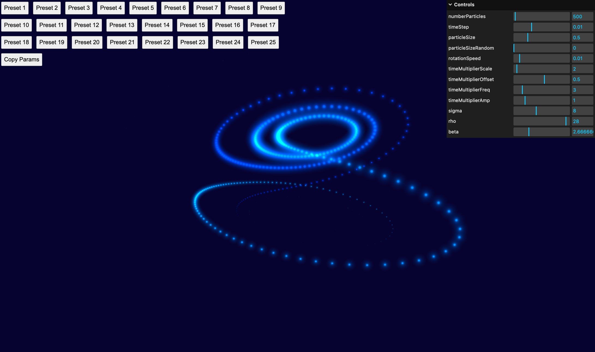
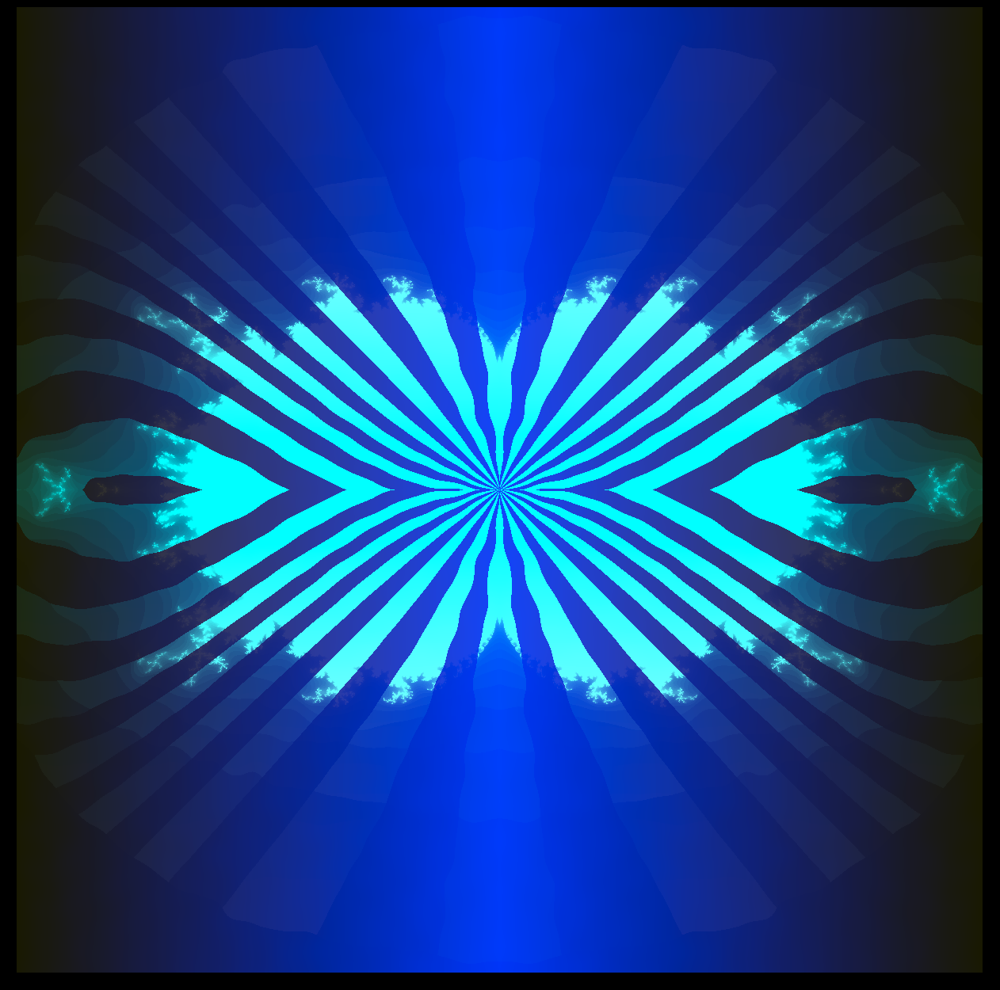
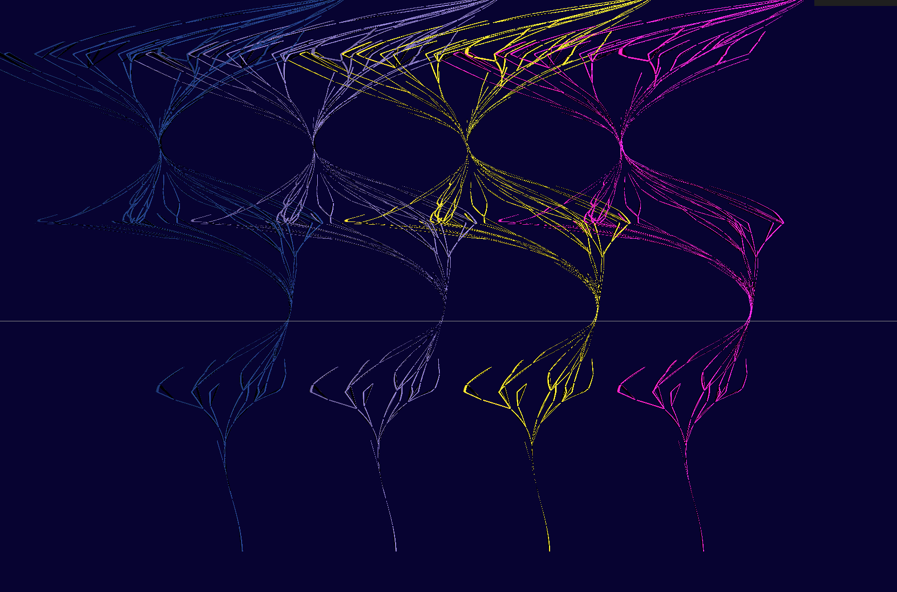

# Shaders with Three.js

This repo tracks my early progress working with shaders in Three.js.

I owe a lot to the [Three.js journey](https://threejs-journey.com/) by Bruno Simon, and also to [Yuri Artiukh](https://www.youtube.com/@akella_) for teaching me almost everything I know about shaders.

I love making generative art, and exploring the place where math commingles with art. Shaders have turned out to be a great medium for exploring that.

I am fascinated by patterns that occur in the natural world, and trying to capture and recreate them with computer graphics and math.

## Screenshots

The first scene that I created on my own, after following various tutorials:

An underwater scene:

Using noise to generated a wood-grain-like texture:

A number of variations on a scene based on particles following the path of a [Lorenz Attractor](https://en.wikipedia.org/wiki/Lorenz_system):

A simple pattern:

A kaleidoscopic pattern:

A space disco dance floor!:

A reflective puddle:

---

And then, here are some screenshots of other scenes I have built with Three.js and shaders, not currently contained within this repo:

Some clouds based on noise:

A kaleidoscope:

A sunset on the sea:

Some flattened colorful waves:

A distorted sphere:

A fun billboard with fireworks:

Some image distortion:

A chart representing my progress in the game Balatro:

A Christmas tree, sort of:

A volcano:

Using noise:

An attempted sea urchin:

A starry pattern:

A distorted sphere:

Using noise:

Terrain with noise:

Night scene:

Waterways:

Sunset:

Mandlebrot set:

Flattened cityscape:

Weird city:

Desert formations:

Distorted trees:

A ripple advancing:

